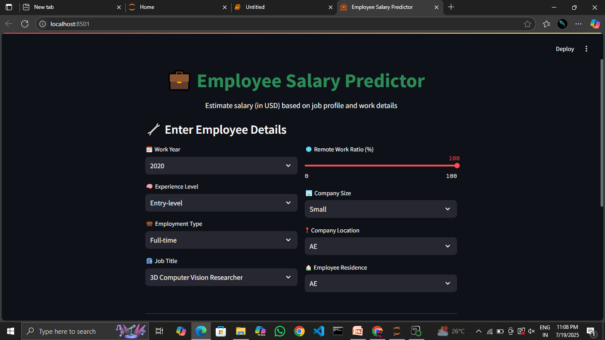
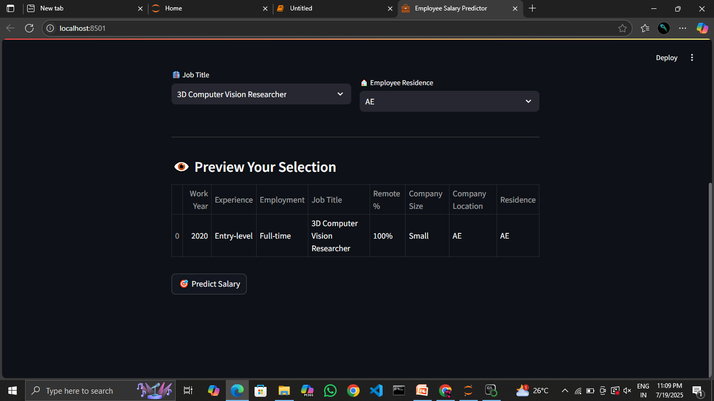
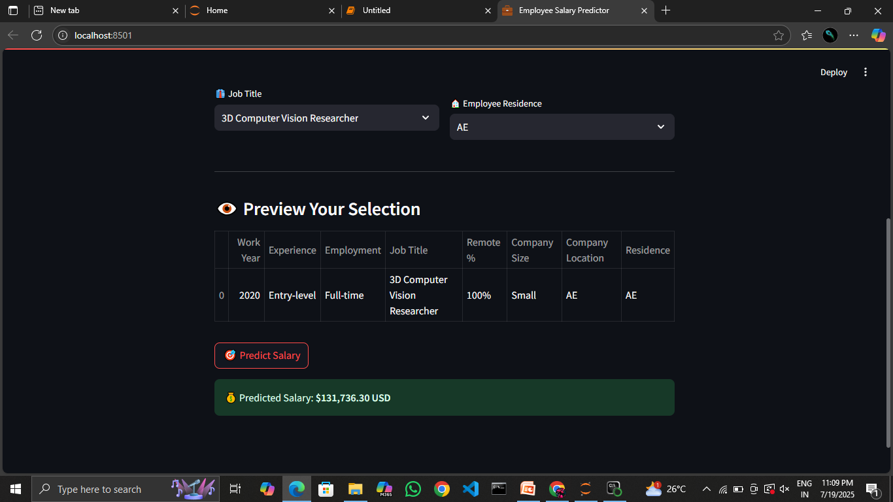

# 💼 Employee Salary Prediction

This project predicts employee salaries using machine learning based on job details like title, experience level, work setup, and company information. It uses the **XGBoost algorithm** and a **Streamlit** web app for user-friendly interaction.

---

## 🚀 Project Demo

---

## 📌 Features

- Predicts salary in USD based on job details
- Simple UI to enter inputs like job title, experience, etc.
- Built using XGBoost for high accuracy
- Interactive interface powered by Streamlit
